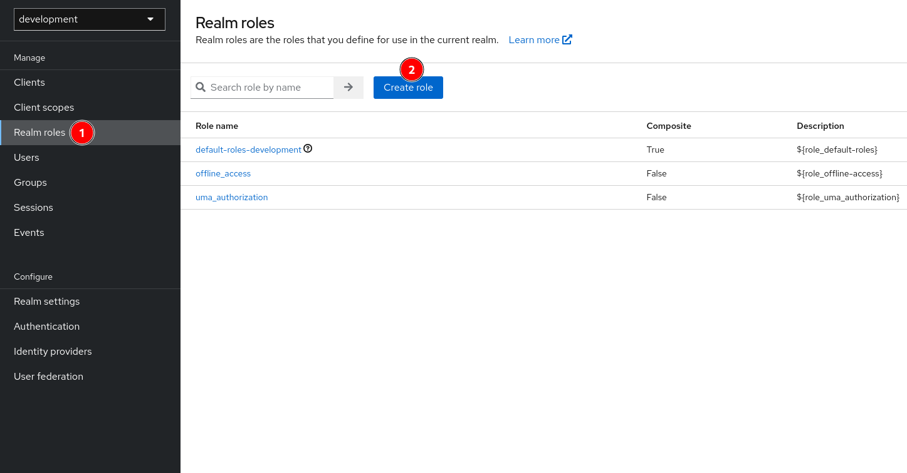
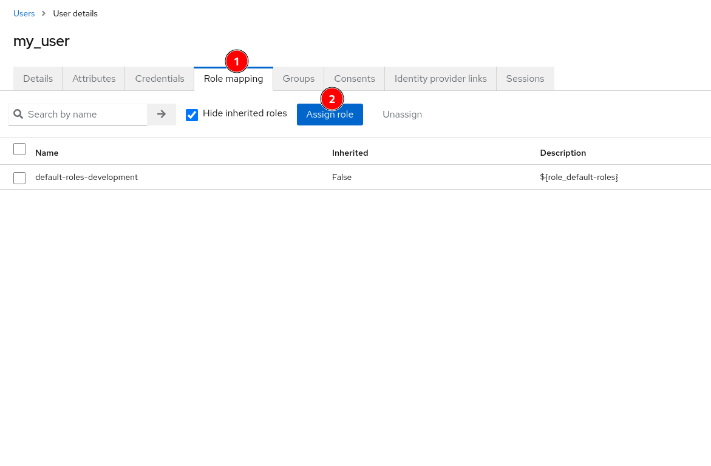
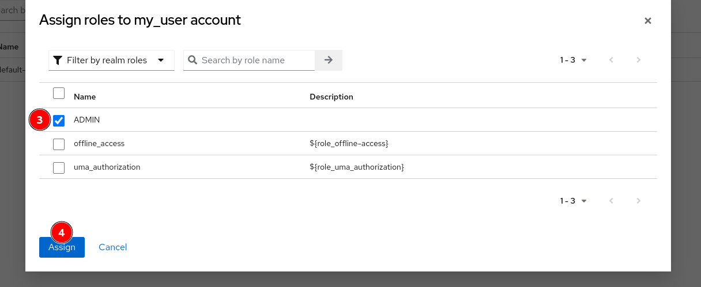

# Keycloak authentication and authorization

Welcome! Keycloak authentication and authorization is a project that shows how we can integrate the back end and front end with Keycloak. With this project the users can authentication and according to their respective roles, they can or not, perform an action on the app.

## Project structure

```
backend-spring-boot/ # Java + Spring boot + Gradle
database/ # Postgres database service
frontend-react-ts/ # React app + Typescript
frontend-vue-ts / # VueJS app + Typescript
keycloak / # Keycloak service
```

## What was used to build it?

- Spring Boot
- Vite + VueJS + Typescript
- Vite + ReactJS + Typescript
- Keycloak
- Postgres Database

## Pre-install

The ports used on this are:

- 9090 for Backend
- 9091 for Keycloak
- 8080 for VueJS
- 8081 for ReactJS

Make sure those ports are available.

### Database service

Go to the database's folder and create the `.env` file from the `.env.example` file. Update the file `.env` and it should be like this:

```
POSTGRES_USER=keycloak_user
POSTGRES_PASSWORD=<DATABASE_PASSWORD> # put you db password here
POSTGRES_DB=keycloak
```

### Keycloak service

Go to the keycloak's folder and create the `.env` file from the `.env.example` file. Update the file `.env` and it should be like this:

```
KEYCLOAK_ADMIN=admin
KEYCLOAK_ADMIN_PASSWORD=admiN!23?
KC_DB=postgres
KC_DB_PASSWORD=<DATABASE_PASSWORD> # put you db password here
KC_DB_USERNAME=keycloak_user
KC_DB_URL=jdbc:postgresql://pg_database:5432/keycloak
KC_HOSTNAME=localhost
```

### VueJS frontend

Go to the frontend-vue-ts's folder and create the `.env` file from the `.env.example` file.

### ReactJS frontend

Go to the frontend-vue-ts's folder and create the `.env` file from the `.env.example` file.

## Install and run - DEV mode

Use the [Docker Desktop](https://docs.docker.com/desktop/) or [Docker engine](https://docs.docker.com/engine/) to install and run.

Use the [JDK 17 or latest](https://openjdk.org/install/) for the backend.

Use the [NodeJS 16 or LTS](https://nodejs.org/en/) for the frontend.

Make sure those items above are installed.

Execute the command line on the root path:

```command-line
$ make install
```

Next, open on your browser on [Keycloak admin](http://localhost:9091/admin)

Do the login using the credentials used on Keycloak's `.env` file. In this example, it should be:

```
Username: admin
Password: admiN!23?
```

Create a new realm with the name: `development`.


Create a new client with the name: `keycloak-authentication-authorization`


Now, set up the client `development` following:


Create two roles (USER and ADMIN):




Create two users (MY_USER and MY_ADMIN) and set the MY_USER to USER and MY_ADMIN to ADMIN:


After create the users, set the passwords for them:


Last thing to do is, set the users to yours respective roles:



Well done! Next, now you can use the Makefile to up the apps:

```
make dev
```

## Access

[VueJS](http://localhost:8080)

[ReactJS](http://localhost:8081)

## Stop services

To stop the services, use the following command:

```
make stop
```

# Scenarios

### Feature: create a new color

```
Rule: only the USER role must do that

Given that I am authenticated
And do not have the color "black" with the hex value "#0000" on the list of colors
When I register the "black" color with the hex value "#0000"
Then the color "black" with the hex "#0000" value should be listed on the list of colors
```

### Feature: list colors

```
Rule: only both USER and ADMIN must do that

Given that I am authenticated
And there are colors registered
Then the colors registered should be listed on the list of colors
```

### Feature: list of color empty

```
Rule: only both USER and ADMIN must do that

Given that I am authenticated
But do not have colors registered
Then the warning message "No colors in the system, yet! Create a new one!" should be shown
```

### Feature: delete a color

```
Rule: only ADMIN must do that

Given that I am authenticated
And the color "white" with the hex value "#9999" is listed on the list of colors
When I remove the color "white" with the hex value "#9999"
Then the color "white" with the hex value "#9999" should not be listed on the list of colors
```

# Next version

- Make the keycloak client private
